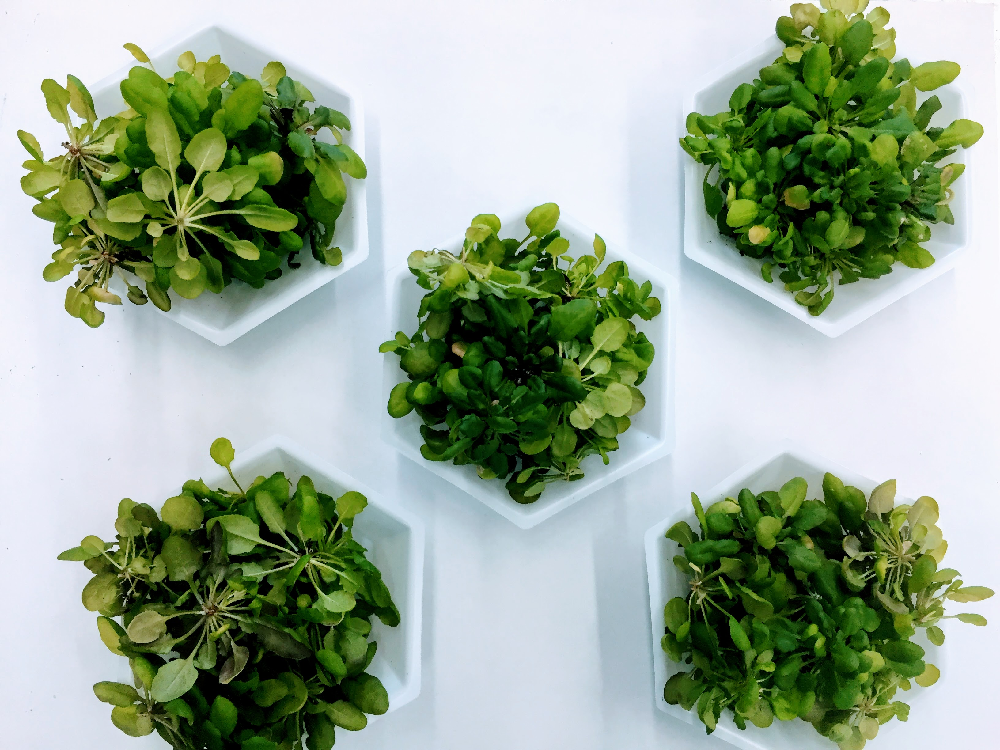

# plant_phosphorylated_proteins

This notebook uses a popular plant protein database to find proteins that are fewer than 200 amino acids and also membrane bound or associated using pandas.

Plant database "p3db-3.5-phosphoprotein-report" downloaded 11 May 2020 from http://www.p3db.org/download.php

